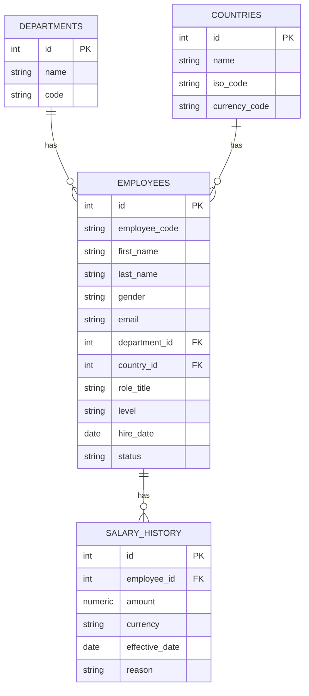

# Architecture

## Data Model

**"Current salary" is derived, not stored.** `salary_history` is append-only
and effective-dated with no `end_date` column. An employee's current salary
is the row with the greatest `effective_date <= today`. This is computed with
one reusable pattern (`app/crud/current_salary.py`): a window function
(`ROW_NUMBER() OVER (PARTITION BY employee_id ORDER BY effective_date DESC)`)
filtered to `rn = 1`. Every place that needs "current salary" — the employee
list, the employee detail view, and every analytics/equity query — joins
against this one subquery rather than re-deriving the logic.

Why not store a redundant `current_salary` column on `employees`? It would
require updating that column transactionally every time a `salary_history`
row is inserted, and would be a second source of truth that could drift out
of sync with the history it's supposed to summarize. Deriving it keeps the
history table the single source of truth.

## API

Base path `/api/v1`.

| Endpoint | Purpose |
|---|---|
| `GET /departments`, `GET /countries` | Reference data for dropdowns/filters |
| `GET /employees` | Search + filter + server-side pagination + sort |
| `POST /employees` | Create employee + initial salary_history row (transactional) |
| `GET/PUT/DELETE /employees/{id}` | Detail, bio update, soft delete |
| `GET/POST/DELETE /employees/{id}/salary-history` | Append-only salary history |
| `GET /analytics/summary` | Org-wide headcount; avg/median only if `country_id` given |
| `GET /analytics/by-department?country_id=` | Avg/median/bands by department (country required) |
| `GET /analytics/by-country` | Avg/median/bands by country (no currency mixing, no param required) |
| `GET /analytics/salary-bands?country_id=` | Avg/median/percentiles by level (country required) |
| `GET /analytics/pay-equity/outliers` | Employees deviating from their cohort median |
| `GET /analytics/pay-equity/gender-gap` | Cohorts with a significant gender pay gap |

See `docs/TRADEOFFS.md` for why `country_id` is required on some analytics
endpoints and not others.

## Frontend

React (Vite) + MUI + TanStack Query, single-page app:

- `/employees` — DataGrid, `paginationMode="server"` / `sortingMode="server"`,
  debounced search, filter chips. Never fetches the full 10k rows.
- `/employees/:id` — bio + full salary history + add-raise dialog.
- `/employees/new` — create form.
- `/analytics` — org summary, by-department/salary-bands (country-scoped),
  by-country comparison chart.
- `/equity` — outlier and gender-gap tables with adjustable thresholds.

`api/client.ts` is a thin `fetch` wrapper; `api/types.ts` mirrors the backend
Pydantic response schemas so the two stay in sync deliberately (not via
codegen, given the scope of this project).

## Seed Script

`backend/app/scripts/seed.py` generates 10,000 employees via bulk insert
(`INSERT ... VALUES` with a list of dicts, not per-row ORM saves), seeded
with `Faker.seed(42)` and `random.Random(42)` for a reproducible dataset.
See `docs/PERFORMANCE.md` for timing and `docs/TRADEOFFS.md` for why the
dataset deliberately injects synthetic outliers and a gender pay gap.
